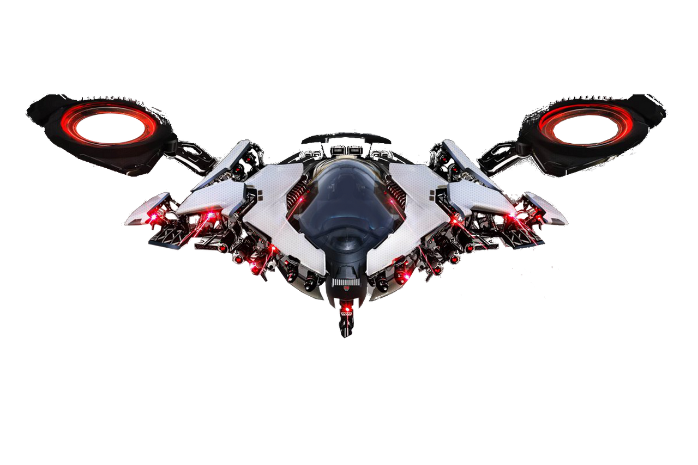

### ¿Que tenemos pensado para el futuro?

Durante el desarrollo de esta actividad, cayó por si sola la idea de generar este programa a modo de interfaz gráfica. Evidentemente esto requiere de muchisimo más esfuerzo que el realizarlo únicamente para una línea de comandos, pero no por ello quiere decir que sea algo imposible. En un futuro tenemos pensado añadir esta características (estamos en ello). 

La idea sería la de añadir y crear diseños de las naves que cada usuario considere o tenga en su imaginación, y representarla de modo gráfico en nuestro simulador. Aquí hay algunos ejemplos de lo que tenemos pensado que haya en un inicio.

**Ejemplo de la nave de carga:**

**Ejemplo de la nave estándar:**

